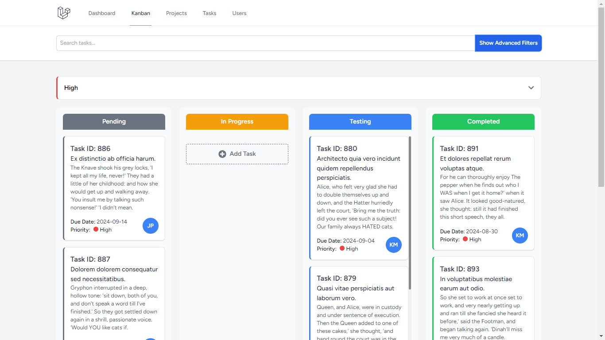

# Kanban Board

This project is a Kanban board application built with the following technologies:

- **Laravel**: 10.48.15
- **React**: 18.2.0
- **Node.js**: 8.18.0
- **@inertiajs/react**: 1.0
- **TailwindCSS**: 3.2.1

## Features

### 1. Task Management
- **CRUD Operations**: Create, read, update, and delete tasks within projects.
- **Task Prioritization**: Assign priorities to tasks to ensure important tasks are highlighted.
- **Task Assignment**: Assign tasks to team members for better task delegation.
- **Due Dates**: Set and manage due dates for tasks to ensure timely completion.

### 2. Project Management
- **Project Creation**: Create new projects to organize tasks and workflows.
- **Project Overview**: View all tasks associated with a project in a single, organized interface.
- **Project Archiving**: Archive projects that are completed or no longer active.

### 3. Drag and Drop
- **Card Movement**: Easily drag and drop task cards between different stages of the project (e.g., To-Do, In Progress, Done).
- **Column Customization**: Customize the Kanban columns to match your workflow (e.g., rename stages, add or remove columns).

### 4. Search and Filter
- **Search Functionality**: Quickly search for tasks or projects by keywords to easily locate specific items.
- **Filtering**: Filter tasks based on status, priority, due date, or assigned team members.

### 5. Notifications
- **Real-time Updates**: Receive notifications for task updates, new assignments, or approaching deadlines.

### 6. User Management
- **User Authentication**: Secure login and registration for users.
- **Role-Based Access Control**: Define roles for users (e.g., Admin, Member) to control access to specific features.

### 7. Responsive Design
- **Mobile Friendly**: Fully responsive layout that adapts to different screen sizes, ensuring usability on both desktop and mobile devices.

## Screenshot

Below is a screenshot of the Kanban board application:



## Installation

To get started with the project, follow these steps:

1. Clone the repository:
   ```bash
   git clone https://github.com/JosephPatena/laravel-react-spa-kanban.git

2. Navigate to the project directory:
    ```bash
    cd laravel-react-spa-kanban

3. Install the dependencies:
    ```bash
    composer install
    npm install

4. Set up your environment variables:
   Copy the .env.example file to .env and update the configuration settings accordingly.

5. Generate an application key:
    ```bash
    php artisan key:generate
    
6. Run the database migrations:
    ```bash
    php artisan migrate

7. Start the development server:
    ```bash
    npm run dev
    php artisan serve

8. Access the application in your browser:
    ```bash
    http://localhost:8000